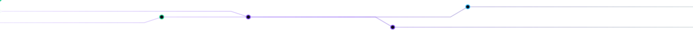
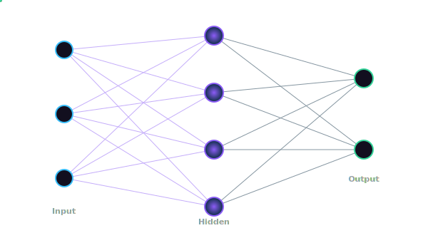
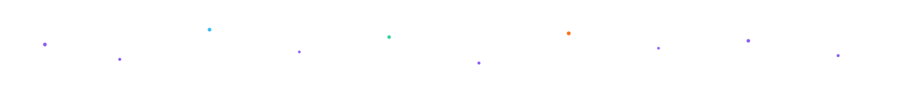

<!-- =====================================================================
     RIMSHA NAZIR · GitHub Profile README
     Design system — Premium Dark AI (glassmorphism, ~85% dark):
       Base    ·  Primary BG #0D0B16 · Secondary BG #0F0D18 · Card/Glass #120F1F
       Depth   ·  Deep Blue Accent #0C2D43   (layered gradients, shadows, glass)
       Accents ·  Purple Glow #8B5CF6 · Sky Blue #38BDF8 · Emerald #34D399
                  Orange #F97316 · Amber #FACC15
                  → used only for highlights, icons, badges, AI nodes & particles
       Text    ·  White #F8FAFC · Gray #9CA3AF
     Backgrounds use smooth gradients between the base + deep-blue colors.
     All local SVGs live in /assets and are animated with native SVG.
     Analytics widgets are themed with the same palette.
     ===================================================================== -->

<!-- ============================ 1 · HERO ============================ -->

  

 
    
<!-- Typing headline (themed to palette) -->

  

    

<!-- ============================ 2 · ABOUT ME ============================ -->
<h2 align="center">🧠 &nbsp;About Me</h2>

<table width="100%" border="0">
  <tr>
    <td width="62%" valign="top">
       
      

        I'm <b>Rimsha Nazir</b>, an <b>AI Marketing Engineer</b> who lives at the intersection of
        <b>marketing strategy</b> and <b>intelligent automation</b>. I design systems that
        find the right people, start the right conversations, and let AI do the heavy lifting —
        so growth becomes repeatable, measurable, and calm.
      

      <ul>
        <li>🤖 &nbsp;I build <b>AI automations</b> that replace repetitive marketing busywork.</li>
        <li>🎯 &nbsp;I engineer <b>lead-generation pipelines</b> that fill funnels on autopilot.</li>
        <li>✉️ &nbsp;I craft <b>email-marketing systems</b> that actually convert.</li>
        <li>🌱 &nbsp;Always learning — currently going deeper into <b>agentic AI workflows</b>.</li>
        <li>💬 &nbsp;Ask me about AI, growth automation, or building things that scale.</li>
      </ul>
    </td>
    <td width="38%" valign="middle" align="center">
      
    </td>
  </tr>
</table>

<!-- ============================ 3 · WHAT I DO ============================ -->
<h2 align="center">⚡ &nbsp;What I Do</h2>

 
    
  

<table width="100%" border="0">
  <tr>
    <td width="33%" align="center" valign="top">
      <h3>🧩 Automate</h3>
      I connect tools into self-running workflows so marketing operations run without manual effort.
    </td>
    <td width="33%" align="center" valign="top">
      <h3>📈 Generate</h3>
      I build lead-gen engines that research, enrich and reach prospects at scale.
    </td>
    <td width="33%" align="center" valign="top">
      <h3>🚀 Convert</h3>
      I design email journeys and AI copy systems that turn attention into revenue.
    </td>
  </tr>
</table>

<!-- ============================ 4 · SERVICES ============================ -->
<h2 align="center">🛠️ &nbsp;Services</h2>

<table width="100%" border="0">
  <tr>
    <td width="50%" valign="top">
      <h3>🤖 AI Automation</h3>
      
End-to-end workflow automation with n8n, Make &amp; custom scripts — connecting your CRM, inbox and data into one intelligent system.

    </td>
    <td width="50%" valign="top">
      <h3>🎯 Lead Generation</h3>
      
Automated prospecting, enrichment and outreach pipelines that keep your pipeline full without the manual grind.

    </td>
  </tr>
  <tr>
    <td width="50%" valign="top">
      <h3>✉️ Email Marketing</h3>
      
High-converting sequences, deliverability tuning and AI-personalized campaigns that feel one-to-one at scale.

    </td>
    <td width="50%" valign="top">
      <h3>🧠 AI Systems &amp; Prompts</h3>
      
Custom GPT assistants, prompt engineering and AI copy engines tailored to your brand voice and funnel.

    </td>
  </tr>
</table>

<!-- ============================ 5 · TECH STACK ============================ -->
<h2 align="center">🧬 &nbsp;Tech Stack</h2>

  <!-- AI = purple · Automation = green -->
  
<b>AI &amp; Automation</b>

  
  
  
  

    
  <!-- Marketing = energy (orange / amber) -->
  
<b>Marketing &amp; Data</b>

  
  
  
  

    
  <!-- Engineering = technology (blue) -->
  
<b>Engineering</b>

  
  
  
  
  

<!-- ============================ 6 · CURRENT LEARNING ============================ -->
<h2 align="center">🌱 &nbsp;Current Learning</h2>

<table width="100%" border="0">
  <tr>
    <td align="center" width="25%"><h4>🕸️ Agentic AI</h4>Multi-step autonomous agents &amp; tool use</td>
    <td align="center" width="25%"><h4>📊 Growth Analytics</h4>Attribution &amp; funnel intelligence</td>
    <td align="center" width="25%"><h4>🔗 Vector &amp; RAG</h4>Knowledge-grounded AI assistants</td>
    <td align="center" width="25%"><h4>⚙️ Backend APIs</h4>Scaling automation infrastructure</td>
  </tr>
</table>

<!-- ============================ 7 · GITHUB ANALYTICS ============================ -->
<h2 align="center">📊 &nbsp;GitHub Analytics</h2>

  <!-- Stats + Streak (themed to palette) -->
  
  

 
  

    

  <!-- Activity graph -->
  

    

  

<!-- ============================ 8 · FEATURED PROJECTS ============================ -->
<!-- Replace the placeholder cards below with your real projects.
     Keep the structure: Name · Description · Technologies · Status Badge. -->
<h2 align="center">🚀 &nbsp;Featured Projects</h2>

<table width="100%" border="0">
  <tr>
    <!-- Project 1 -->
    <td width="50%" valign="top">
      <h3>🤖 AI Outreach Engine</h3>
      
Automated lead-gen pipeline that researches prospects, personalizes cold emails with AI, and books meetings — hands-free.

      

        
        
        
      

      
    </td>
    <!-- Project 2 -->
    <td width="50%" valign="top">
      <h3>✉️ Smart Email Studio</h3>
      
AI-powered email-marketing system generating on-brand sequences, subject lines and A/B variants with deliverability scoring.

      

        
        
        
      

      
    </td>
  </tr>
  <tr>
    <!-- Project 3 -->
    <td width="50%" valign="top">
      <h3>📊 Growth Dashboard</h3>
      
Unified marketing analytics that pulls from CRM, ads and email into a single AI-summarized view of funnel health.

      

        
        
        
      

      
    </td>
    <!-- Project 4 -->
    <td width="50%" valign="top">
      <h3>🧠 Brand Voice GPT</h3>
      
Custom AI assistant trained on brand guidelines to draft copy, replies and campaigns in a consistent voice.

      

        
        
        
      

      
    </td>
  </tr>
</table>

<!-- ============================ 9 · EXPERIENCE & GOALS ============================ -->
<h2 align="center">🎯 &nbsp;Experience &amp; Goals</h2>

<table width="100%" border="0">
  <tr>
    <td width="50%" valign="top">
      <h3>💼 Experience</h3>
      <ul>
        <li>Built AI-driven lead-generation systems for growth-focused teams.</li>
        <li>Designed automated email journeys that lift conversion and retention.</li>
        <li>Connected marketing stacks into unified, self-running workflows.</li>
        <li>Engineered custom GPT assistants for on-brand content at scale.</li>
      </ul>
    </td>
    <td width="50%" valign="top">
      <h3>🌠 Goals</h3>
      <ul>
        <li>Ship a reusable open-source AI marketing-automation toolkit.</li>
        <li>Master agentic AI workflows end-to-end.</li>
        <li>Help 100+ businesses grow with intelligent automation.</li>
        <li>Speak &amp; write about the future of AI-powered marketing.</li>
      </ul>
    </td>
  </tr>
</table>

<!-- ============================ 9 Top Languages ============================ -->
<h2 align="center">Top Languages</h2>

<!-- ============================ 10 · CONNECT ============================ -->
<h2 align="center">🤝 &nbsp;Connect With Me</h2>

  
   
  
Open to collaborations, freelance projects and conversations about AI-powered growth.

  
  
  

<!-- ============================ 11 · VISITOR COUNTER ============================ -->
<h2 align="center">👁️ &nbsp;Visitors</h2>

  
    
  
  

  

<!-- ============================ 12 · DEV QUOTE ============================ -->

<!-- ============================ 13 · FOOTER ============================ -->

  Designed &amp; built with 💜 by <b>Rimsha Nazir</b> · Powered by native SVG animations &amp; a unified AI design system.

